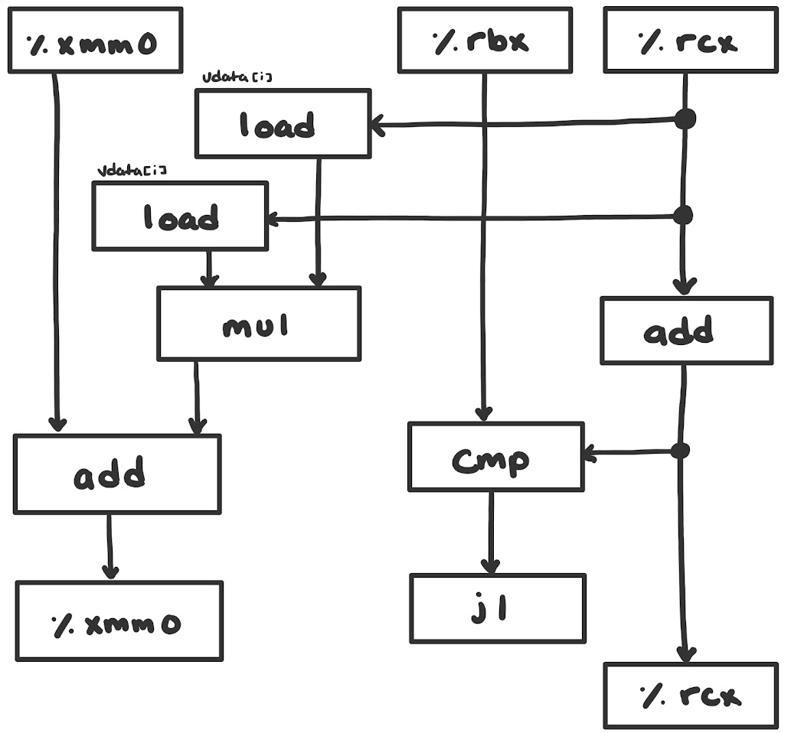

##### Alex Sobiek 
##### COMP 264
##### Dr. Greenberg

### Homework 6-1

#### A. Diagram how this instruction sequence would be decoded into operations, and show how the data dependencies between them would create a critical path of operations in the style of Figures 5.13 and 5.14 The one of these that we ultimately want submitted in this homework really is Figure: opt/dpb-flow. (25 points.)



#### B. For data type double, what lower bound on the CPE is determined by the critical path? Give a numerical value and an explanation. (6 points.) 

On our reference machine, floating-point addition has a latency of 3 and floating-point multiplication has a latency
of 5. Therefore, our lower bound on the CPE is 3+5, or 8. 

#### C. Assuming similar instruction sequences for the integer code as well, what lower bound on the CPE is determined by the critical path for integer data? Give a numerical value and an explanation. (6 points.)

On our reference machine, integer addition has a latency of 1 and integer multiplication has a latency of 3. Therefore,
our lower bound on the CPE is 3+1, or 4. 

#### D. Explain how the floating-point version can have a CPE of 3.00 even though the multiplication operation requires 5 cycles. (6 points.)

The multiplication operation is fully pipelined, or has an issue time of just 1 cycle. This means that with each CPU 
cycle, we can start a new multiplication operation (or in this case, two because we have two floating-point functional
units). This means in just 2 CPU cycles, we can complete 4 floating-point multiplication operations inside the loop.
However, because each iteration also includes an addition operation, and we cannot move to the next iteration without 
finishing the addition, so we're limited by the latency of addition which is 3.

### Homework 6-2
#### Write a version of the inner product procedure described in the previous problem that uses four-way loop unrolling with four parallel accumulators. (15 points.)
```c
void inner5(vec_ptr u, vec_ptr v, data t *dest) {
    long i;
    long length = vec_length(u);
    data_t *udata = get_vec_start(u);
    data_t *vdat
    a = get_vec_start(v);
    // initialize 4 sums for parallel operations 
    data_t sum = (data_t) 0, sum1 = sum, sum2 = sum, sum3 = sum;
    for (i = 0; i < length; i+=4){ // Perform the operations of 4 iterations in 1
        sum += udata[i]*vdata[i];
        sum1 += udata[i+1]*vdata[i+1];
        sum2 += udata[i+2]*vdata[i+2];
        sum3 += udata[i+3]*vdata[i+3];
    }
    for (; i < length; i++) sum += udata[i] * vdata[i]; // Finish remaining elements
    *dest = sum + sum1 + sum2 + sum3; // Add up all sums
}
```

#### Measurements for this function with x86-64 suggest that the CPE goes down essentially to 1 for both integer and floating-point data. What factor prevents the performance from going any lower than a CPE of 1.00?

We're limited to a CPE of 1.00 due to the floating-point addition functional unit having a throughput bound of 1.00.